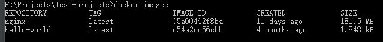
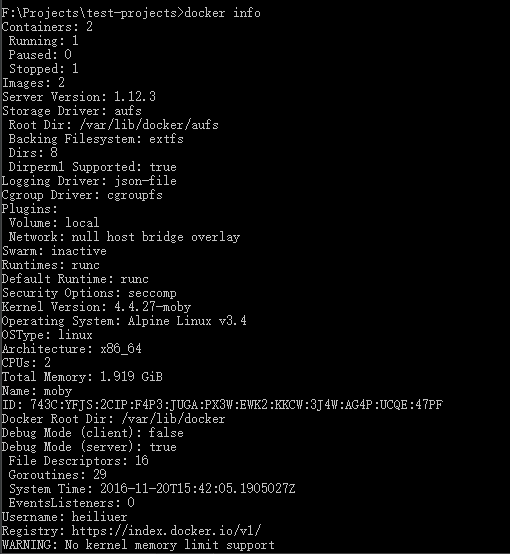
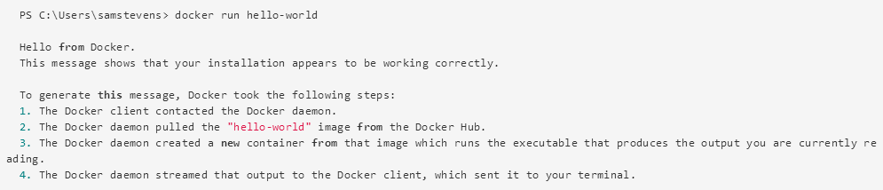
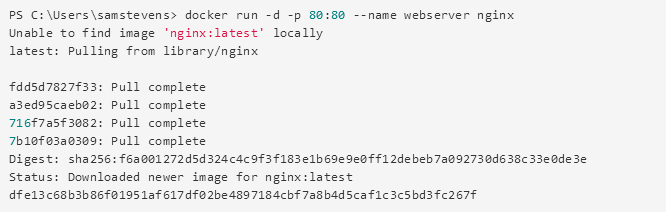

1. 安装docker

    > intel平台 运行docker可能提示
    
        Hardware assisted virtualization and data execution protection must be enabled in the BIOS

    > 重启进入bios，cpu设置选项中开启intel visualization
    
    
2. 运行helloworld
    
    - `docker ps`
      
        > 查看正在运行的docker container列表
        
        
        
    - `docker ps -a`
      
        > 查看所有的docker container列表
        
    - `docker ps -l`
      
        > It is some times handy to view the latest created container, including non-running containers. Simply use the -l option:
        
    - `docker images`
      
        > 查看已下载所有docker image
        
        
    
    - `docker info`
        
        > 查看docker的运行状态
        
        
    
    - `docker version` 
        
        > 查看docker的版本信息
    
    - `docker run helo-world` 
        
        > 从docker hub pull hello-world镜像（除开已经pull（下载）到本地的情况），并部署到docker container中
        
        
        
    - `docker run -d -p 80:80 --name webserver nginx` 
        
        > 从docker hub pull nginx镜像，部署到docker container（containner取名webserver）中，映射本机端口80到容器端口80
        
        > 浏览器访问localhost，可以看到nginx welcome页面
        
        
    
3. Stop or remove containers and images
    
    > The nginx webserver will continue to run in the container on that port until you stop and/or remove the container.
    
    - `docker stop webserver` 
        
        > 关闭名为 webserver 的container
      
    - `docker start webserver` 
        
        > 再次启动
    
    - `docker rm -f webserver`
    
        > This will remove the container, but not the nginx image
    
    - `docker rmi <imageID>|<imageName>`
        
        > To remove an image you no longer need  
      
4. Docker settings
    
    - `Shared Drives`
    
        > `docker run --rm -v c:/Users:/data alpine ls /data` 
    