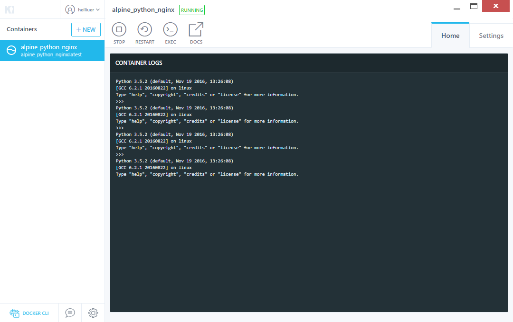
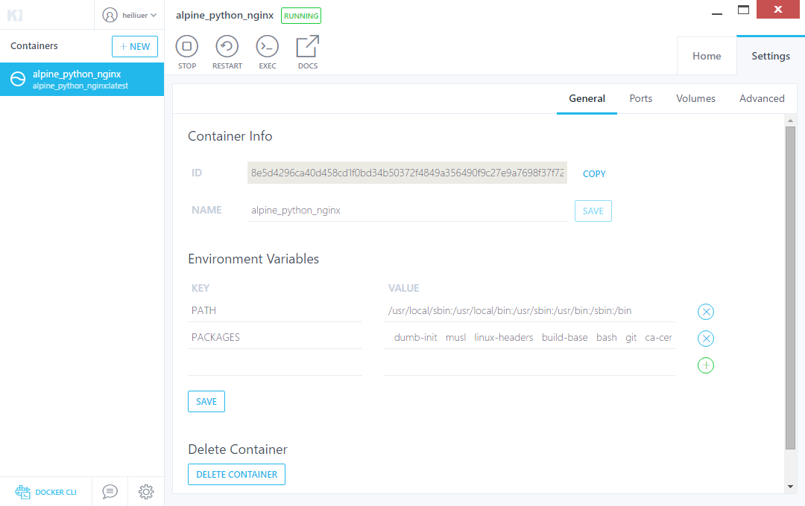

1. [docker hub](https://hub.docker.com/) 中查找image(repo)
    
2. 使用 docker/whalesay image创建docker container

    `docker run docker/whalesay cowsay heiliuer`
    
    > container 启动后运行命令 cowsay heiliuer cowsay是container一个小游戏程序
        
3. 创建自己的image
    
    - 新建编辑 `mydockerbuild/Dockerfile` 文件，
    
    - 在 `mydockerbuild` 目录下执行命令
    
        `docker build -t docker-whale .` 读取当前目录的Dockerfile配置，创建名为 docker-whale 的docker image
        
        `docker run docker-whale .` 运行创建的 image

4. 关联image 到 docker hub 的 repo

    `docker tag <image id> heiliuer/docker-whale:latest`
    
    `docker login`
    
    `docker push heiliuer/docker-whale`
    
5. pull image
    
    - remove image
        
        `docker rmi -f <image name> or <repository<:tag>>`
        
        > -f 强制删除，被依赖也会删除
        
    - pull and run image
    
        `docker pull  heiliuer/docker-whale`
        
        or
        
        `docker run heiliuer/docker-whale`
        
6. 后台一直运行ubuntu

    > -d To start a container in detached mode, you use -d=true or just -d option. By design, containers started in detached mode exit when the root process used to run the container exits. A container in detached mode cannot be automatically removed when it stops, this means you cannot use the --rm option with -d option.
    
    > --rm container automatically removed when it stops

    `docker run --name ubuntu -d ubuntu /bin/sh -c "while true; do ping 8.8.8.8; done"`
    
    `docker log ubuntu` 查看container 日志docker 命令 的输出
    
    `docker exec -it ubuntu(<repo:tag or image-id>) /bin/bash` 执行container的shell，进行shell交互(需要container在running)
    
    `docker run -i -t ubuntu(<repo:tag or image-id>) /bin/bash` 执行container的shell，进行shell交互(针对container没有running)
    
     > -t, --tty Allocate a pseudo-TTY (指定一个虚拟终端)
     
     > -i Keep STDIN open even if not attached
    
    
    
7. docker 官方的 image repository 在国内很慢，可以使用国内docker.io的repository

    `docker pull daocloud.io/library/ubuntu`
    
7. docker 修改镜像的 repository

    `docker tag <image name or repository<:tag>> <new-repository<:tag>>`
    
    > repository 和 new-repository 共用一个image 可以删除旧的 repository
    
    `docker rmi repository<:tag>>`
    
9. 提交

    `docker commit <container id> heiliuer/heiliuer-ubuntu:version1`
    
    `docker commit <container id> heiliuer/heiliuer-ubuntu:latest`
    
    
10. 使用  Kitematic 图形界面 管理container  

    
    
    